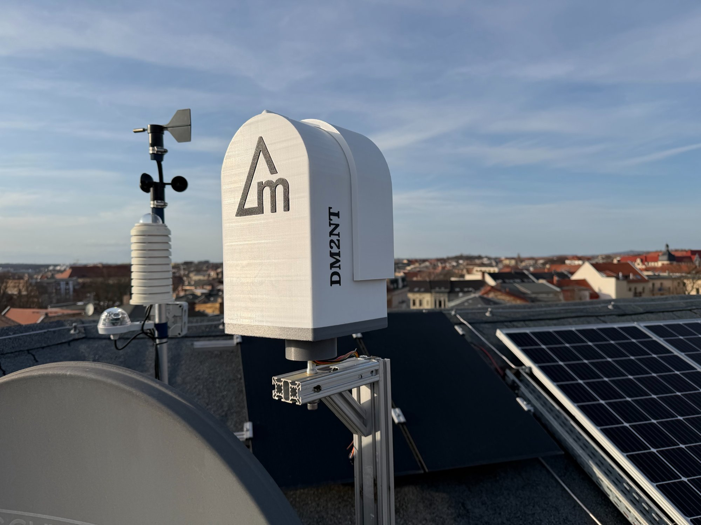
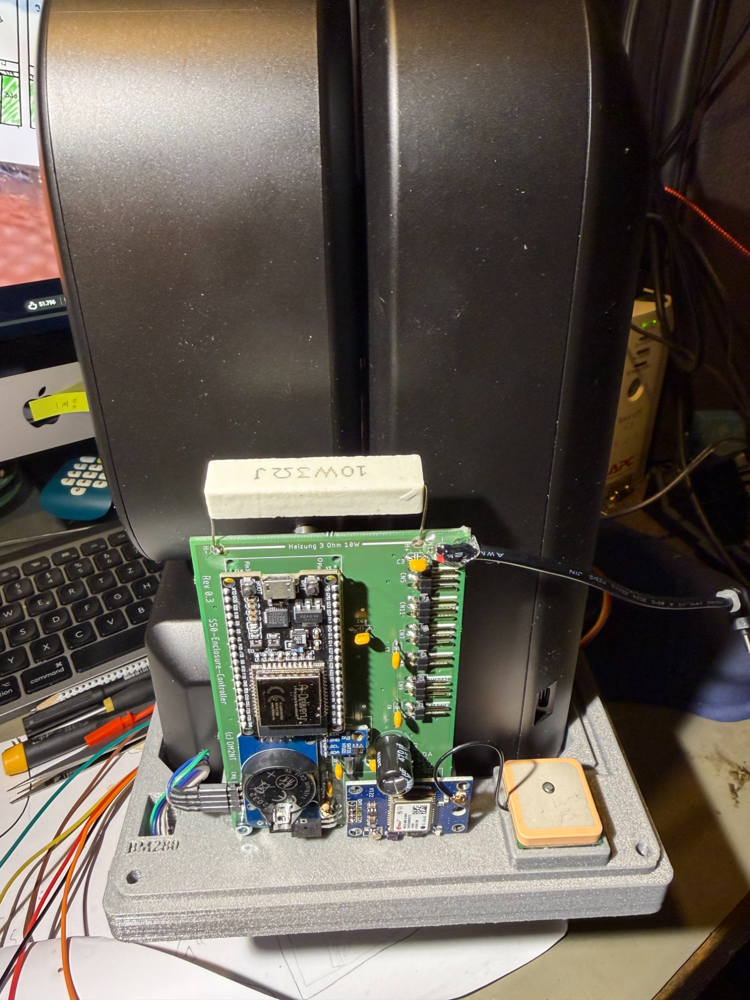
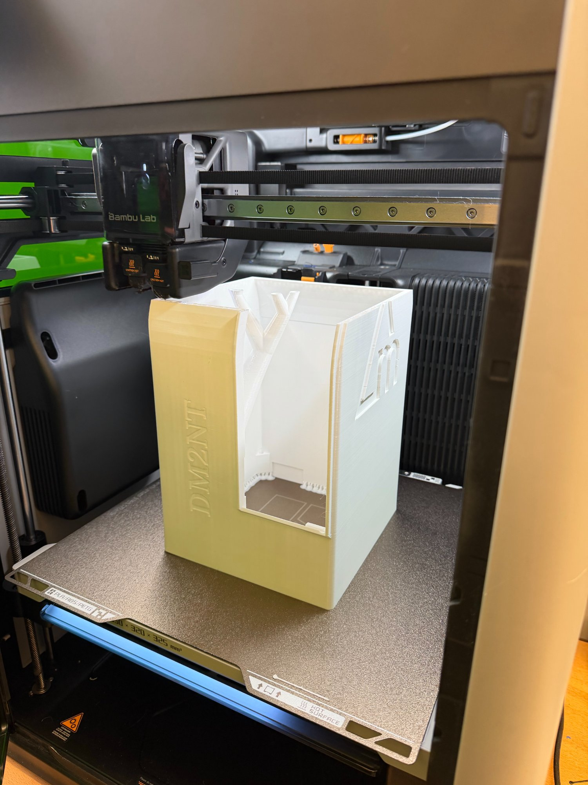
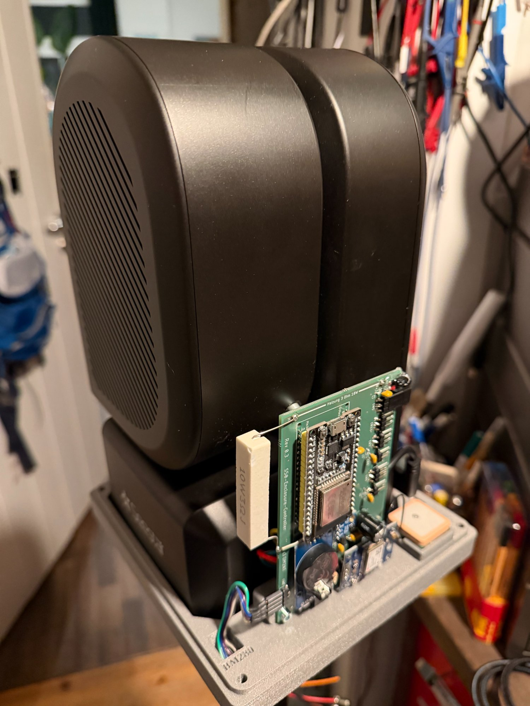
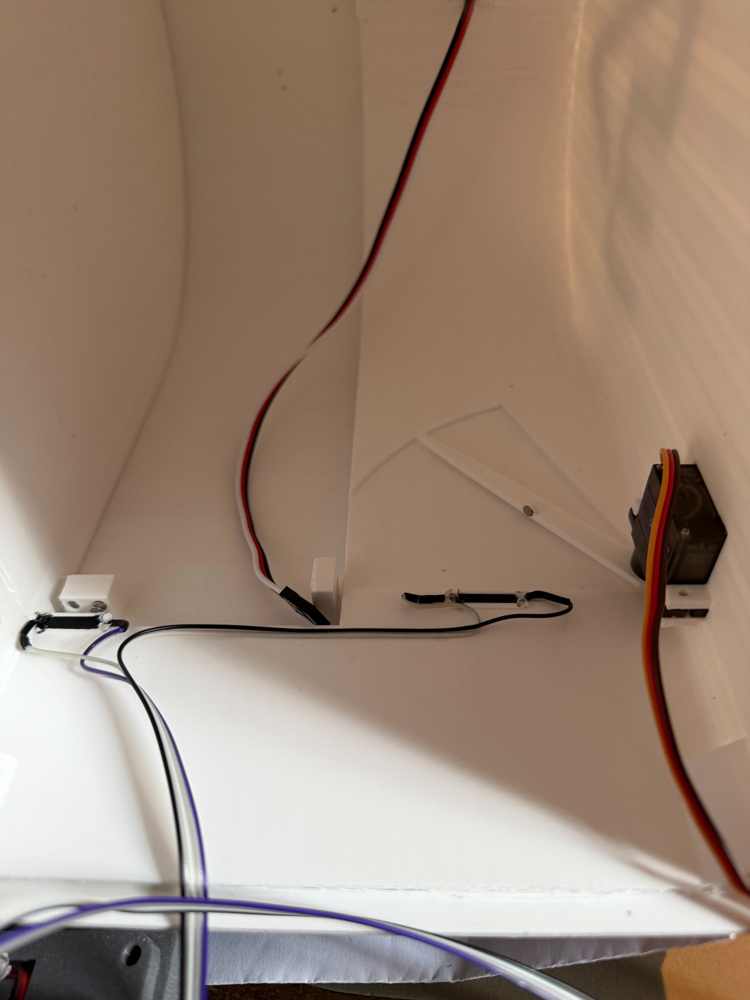
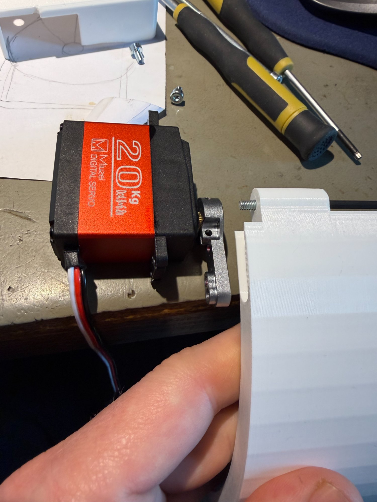
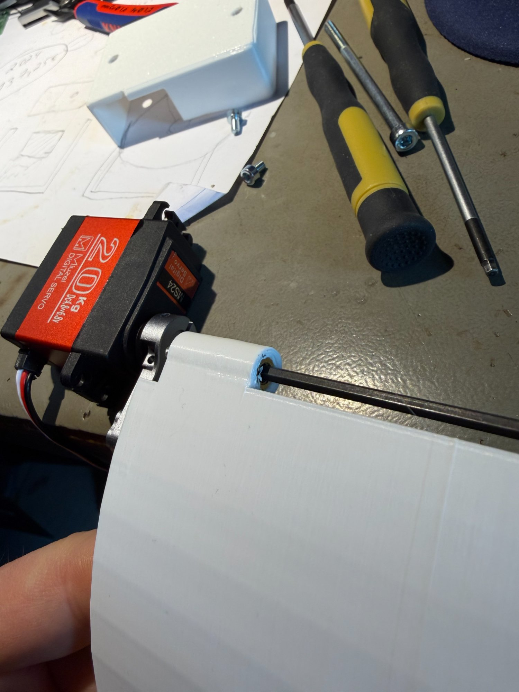
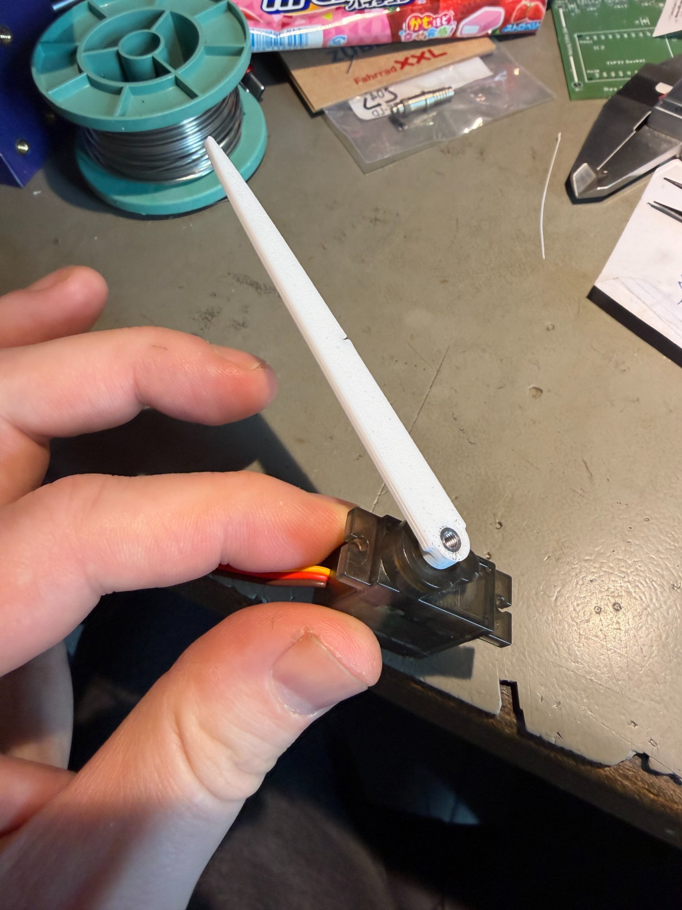

# Seestar S50 Observatory Controller

**ESP32-basierte Wetterstation und automatische Schutzabdeckung für das Seestar S50 Teleskop**



## Übersicht

Dieses Projekt bietet eine vollautomatische Wetterüberwachung und Teleskopschutz-Lösung für das Seestar S50. Bei ungünstigen Wetterbedingungen (Regen, Wind, hohe Luftfeuchtigkeit) schließt sich die motorisierte Abdeckung automatisch, um das Teleskop zu schützen.

**Hauptfunktionen:**
- ✅ Automatische Regenüberwachung (Hydreon RG-11)
- ✅ Temperatur- und Luftfeuchtigkeits-Überwachung (BME280)
- ✅ Taupunktberechnung mit Heizungssteuerung
- ✅ Motorisierte Schutzabdeckung (MG996R Servo)
- ✅ Seestar S50 Integration (automatisches Parken bei Schlechtwetter)
- ✅ Web-Interface für Steuerung und Monitoring
- ✅ GPS-Zeitabgleich (optional)

## Hardware

### Hauptkomponenten

| Komponente | Modell | Funktion |
|------------|--------|----------|
| Mikrocontroller | ESP32 DevKit | Hauptsteuerung |
| Regensensor | Hydreon RG-11 | Niederschlagserkennung |
| Umweltsensor | BME280 | Temperatur, Luftfeuchtigkeit, Luftdruck |
| Servo | MS24 20kg | Abdeckungsmechanik |
| GPS-Modul | NEO-6M/7M | Zeitabgleich (optional) |
| Heizung | 3 Ohm 15W | Taupunkt-Schutz |



### Gehäuse

Das Gehäuse wurde mit einem **Bambu Lab 3D-Drucker** gefertigt:
- Material: PLA/PETG
- Wetterfest konzipiert
- Kabelführungen integriert
- Montage-Interfaces für Sensoren



## Pin-Belegung

### ESP32 Pins

```cpp
// Servo
#define SERVO_PIN 13

// Reed-Schalter (Position)
#define REED_CLOSED_PIN 32
#define REED_OPEN_PIN 33

// Wind-Sensor (Davis 6410)
#define WIND_PIN 27

// Heizung
#define HEATER_PIN 12

// RG-11 Regensensor
#define RAIN_RX_PIN 35
#define RAIN_TX_PIN 4

// GPS (optional)
#define GPS_RX_PIN 16
#define GPS_TX_PIN 17

// I2C (BME280)
SDA: GPIO 21
SCL: GPIO 22
```



## Installation

### 1. Arduino IDE Setup

```bash
# ESP32 Board Manager URL hinzufügen:
https://raw.githubusercontent.com/espressif/arduino-esp32/gh-pages/package_esp32_index.json

# Benötigte Bibliotheken installieren:
- ESP32Servo
- Adafruit BME280
- TinyGPSPlus
- AsyncTCP
- ESPAsyncWebServer
- Preferences
```

### 2. Firmware flashen

1. `.ino` Datei in Arduino IDE öffnen
2. Board auswählen: **ESP32 Dev Module**
3. Partition Scheme: **Minimal SPIFFS (1.9MB APP with OTA)**
4. Upload Speed: **921600**
5. Kompilieren und hochladen

### 3. Erste Konfiguration

Nach dem ersten Start öffnet der ESP32 einen **WiFi Access Point**:

```
SSID: S50-Enclosure-XXXXXX
Passwort: 12345678
IP: 192.168.4.1
```

Verbinden und WiFi-Zugangsdaten eingeben.

## Konfiguration

### RG-11 Regensensor DIP-Switches
!!! im Moment nicht funktionsfähig !!!

**Für ASCII "It's Raining" Mode:**

| DIP | Position | Funktion |
|-----|----------|----------|
| 1 | **ON** | Empfindlichkeit hoch |
| 2 | **ON** | Empfindlichkeit hoch |
| 3 | OFF | Keine 15-Min-Haltezeit |
| 5 | OFF | RS232 aktiv |
| 7 | **ON** | It's Raining Mode |
| 8 | OFF | Normal (kein Sleep) |

**Wichtig:** DIP 5 MUSS OFF sein für RS232!


### Heizungssteuerung

- Aktiviert wenn: `Temperatur < (Taupunkt + Hysterese)`
- Standard-Hysterese: **2.0°C**
- Heizleistung: **15W** (3 Ohm)

## Web-Interface

Das Web-Interface ist erreichbar unter der ESP32-IP:

**Hauptseite:**
- Live-Sensordaten (2s Refresh)
- Status: Regen, Wind, Temperatur, Luftfeuchtigkeit
- Steuerung: Öffnen, Schließen, Stopp
- Seestar S50 Status

**Einstellungen:**
- WiFi-Konfiguration
- Wind-Schwellwert  ( nicht integriert )
- Heizungs-Hysterese
- Seestar IP-Adresse
- GPS An/Aus



## Servo-Mechanik

Der Servo MS24 mit 20kg Drehmoment steuert die Abdeckung:

- Öffnen: 0° (Reed-Schalter 2)
- Geschlossen: 90° (Reed-Schalter 1)
- Sanftes Anfahren mit Beschleunigung
- Reed-Schalter als Endlagen-Sicherung




### 3D-gedruckte Teile

- Servo-Halterung
- Hebelarm (weiß, verstärkt)
- Gehäuse-Adapter



## Seestar S50 Integration

Bei Regen/Wind schaltet der Controller das Seestar automatisch ab und schließt die Klappe.

- im Moment nicht funktionsfähig


Das Teleskop wird geparkt, bevor die Abdeckung schließt.

## Sicherheitsfunktionen

1. **Regen-Notschließung:** Bei Regenerkennung → sofortige Schließung
2. **Wind-Notschließung:** Bei Überschreitung Schwellwert → Schließung
3. **Reed-Schalter:** Mechanische Endlagen-Sicherung
4. **Motor-Timeout:** Stoppt nach 10s bei fehlendem Reed-Signal
5. **Heizung:** Verhindert Beschlagen/Betauung

## OTA-Updates

Firmware-Updates über WiFi möglich:

```
http://ESP32_IP/update
```

**Wichtig:** Nur `.ino.bin` verwenden, NICHT `merged.bin`!

## Serial Monitor Debug

USB Serial (115200 Baud):
```
RG-11 UART initialisiert (RX=35, 9600 Baud, ASCII Mode)
  Warte auf RG-11 ASCII Daten (max 10s)...
  'Acc' Frame gefunden: Acc 0.00
✓ RG-11 Regensensor erkannt!

💧 RG-11: REGEN! Acc=1.00
⚠️ REGEN ERKANNT! (Acc=1.00) Starte Notschließung...
```

## Stromversorgung

- 5V 4A externes Netzteil 

**Wichtig:** Servo und ESP32 gemeinsame GND-Verbindung!

## Versionshistorie

- **v3.1** - ASCII-Protokoll RG-11, Boot-Erkennung angepasst
- **v3.0** - Umstellung auf ASCII "It's Raining" Mode
- **v2.2** - Slow Register #8 Bucket-Zähler
- **v0.4** - Heizung auf Innentemperatur, stabile Version


## Lizenz

MIT License - siehe LICENSE Datei

## Autor

**DM2NT** - Amateur Radio / Astrophotography  
YouTube: [DeltaMike2 Astronomie](https://youtube.com/@DeltaMike2)

## Danksagungen

Allen Irren, die sich das hier antun.

---

**73!** 📡🔭
